# Book Store Management System

## Project Overview

The Book Store Management System is designed to facilitate online book shopping, catering to two types of users: **Admin** and **Reader**.

### User Roles

- **Admin**: Responsible for managing the book inventory.
- **Reader**: End users who can browse, search for, and purchase books.

### User Details

- **General User Information**:
  - Username
  - Email
  - Password (hashed for security)
  - All user information is encrypted using AES-256 encryption, ensuring that sensitive data is well protected.

- **Reader-Specific Information**:
  - Phone number
  - Address
  - Payment method

### Book Details

Each book in the system is characterized by the following attributes:

- Name
- Author
- Price
- Available stock quantity
- Category

## System Functionalities

### Admin Capabilities

The Admin has the following functionalities:

- **Add Books**: Insert new books into the inventory.
- **Edit Books**: Update details of existing books.
- **Delete Books**: Remove books from the inventory.
- **View All Books**: Display all books, including those out of stock.
- **Search Books**: Find books based on various criteria.

### Reader Capabilities

The Reader can perform the following actions:

- **Register Account**: Create a new user account.
- **Edit Profile**: Update personal information.
- **View Available Books**: Display a list of books currently in stock.
- **Search Books**: Find books by different attributes.
- **Order Books**: Purchase books, which automatically reduces the stock quantity. 
  - Order information is also encrypted using AES-256 encryption.

## Configuration

- The application stores its data in text files located in the `resources` directory, which includes `admins.txt`, `books.txt`, `orders.txt`, and `readers.txt`.
- All stored information is encrypted using AES-256 encryption, and passwords are securely hashed before storage.

## Phase 1 Details

Phase 1 focuses on developing the core functionalities of the Book Store Management System as a console-based application.

## Transition to Phase 2

After completing Phase 1, the project transitioned to Phase 2, where a graphical user interface (GUI) was developed. The codebase for the GUI can be found in the [book-store-gui](https://github.com/adamt-eng/book-store-gui) repository. The commits in the **book-store-gui** repository begin from a point where most of the core functionality was already established in this Phase 1 repository.

## Documentation

For comprehensive documentation of the final project, please refer to the README in the [book-store-gui](https://github.com/adamt-eng/book-store-gui) repository.

---

# Book Store Management System (Phase 2)

## Project Overview

The Book Store Management System is an advanced application designed to facilitate online book shopping, catering to both **Admin** and **Reader** roles. This system has transitioned from a console-based application in [Phase 1](https://github.com/adamt-eng/book-store) to a full-fledged graphical user interface (GUI) in Phase 2.

## Transition from Phase 1 to Phase 2

In Phase 1, the core functionalities were developed as a console-based application. Phase 2 builds upon this foundation, introducing a user-friendly GUI, enhancing the user experience, and expanding the system's capabilities.

This phase focuses on the following key enhancements:

- **Graphical User Interface (GUI)**: The transition from a console-based application to a GUI allows for a more intuitive and visually appealing user experience.
- **Improved User Management**: Streamlined account management for readers, including registration, profile updates, and order tracking.
- **Enhanced Book Management**: Admins can now manage the book inventory through a visually guided interface, making tasks like adding, editing, and deleting books more straightforward.
- **Secure Transactions**: The system continues to prioritize security, ensuring all sensitive information, including user data and order information, is securely handled.

### Documentation Overview

The documentation below outlines the features and functionalities of the final project.

## UML Diagram

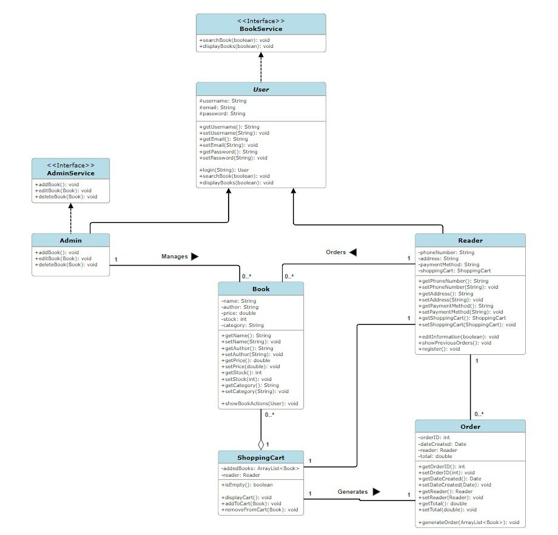

## Overview of the System

## Admin Functions

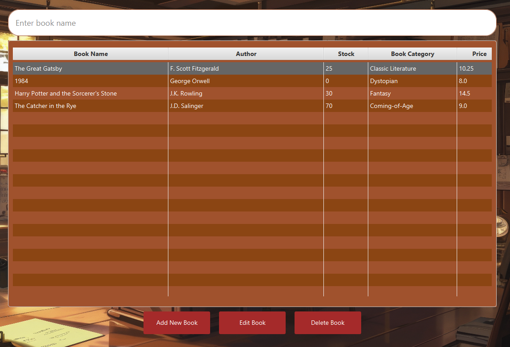

### Add a Book

Admins can add new books to the inventory using the "Add New Book" dialog.

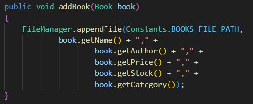

### Edit a Book

Admins can edit book details using the "Edit Book" dialog.

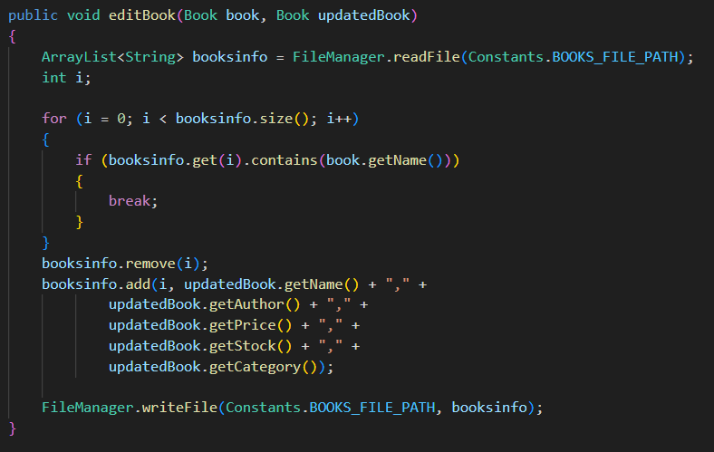

### Delete a Book

Admins can remove books using the `deleteBook(Book book)` method.

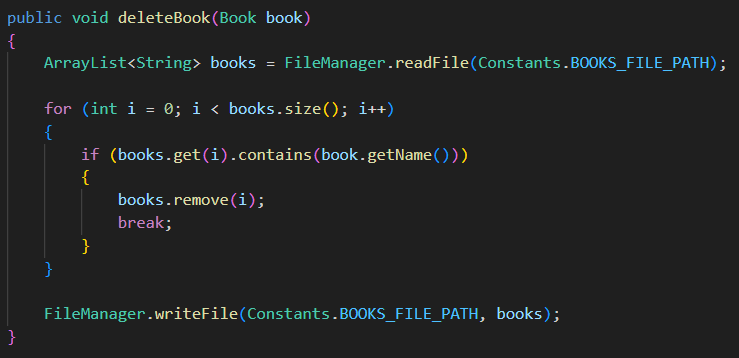

## Reader Functions

Readers can register and manage accounts.

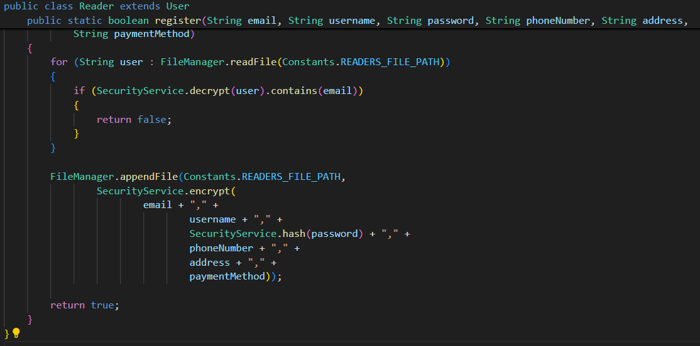

### Edit Account Information

Readers can update their account information.

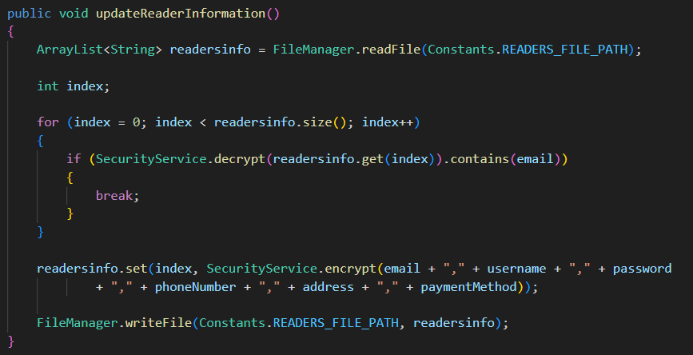

### Show Previous Orders

Readers can view their order history.

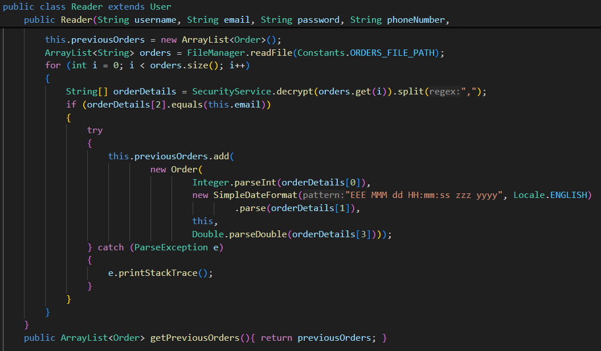

### Display Books

Readers can view available books and add them to the cart.

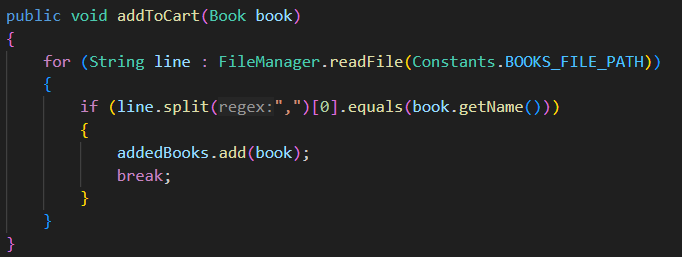

### Display Cart

Readers can manage items in their cart.

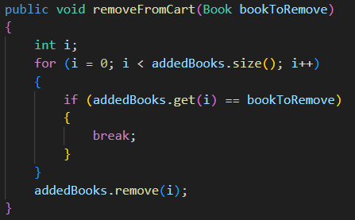

### Go To Receipt

On the receipt page, users can complete purchases.

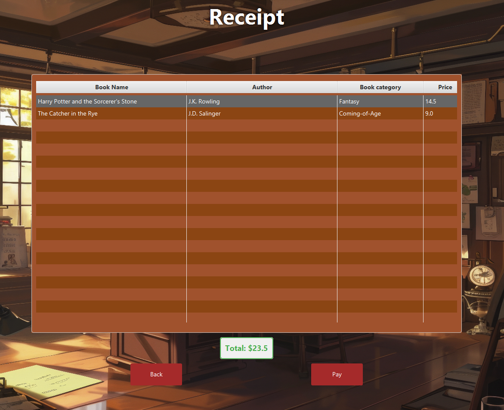

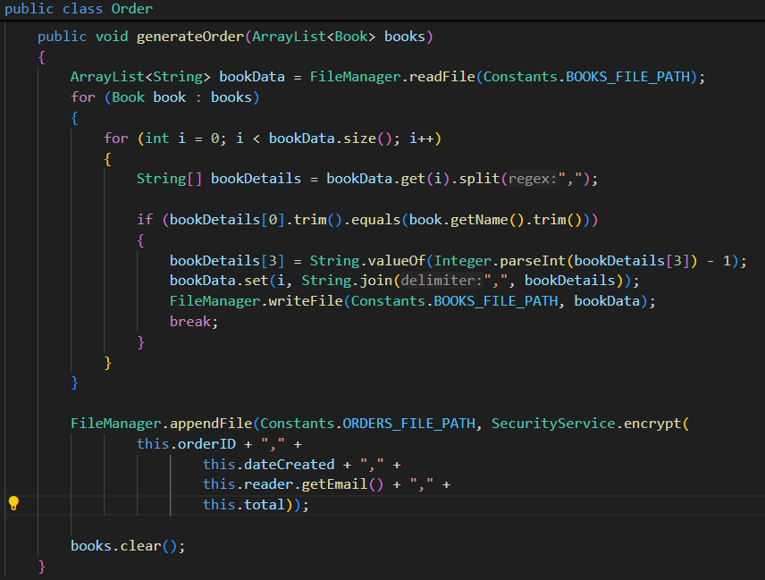